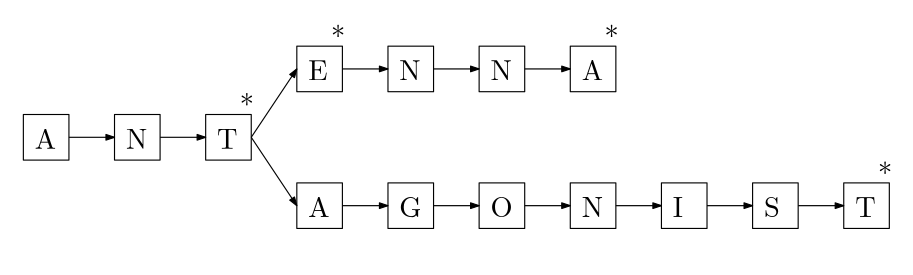

# Classification trees

This is a C++23 tree-like data structure to classify objects using handcrafted key values. The data structure implemented can be iterated normally element-to-element and also supports range queries.

The classification tree in this repository enables users to work with an arbitrary number of key values with little to no added code complexity. At every node of the tree is stored pairs of (key, subtree). At depth level $i$ of the tree, the key values in the pairs correspond to $k_i$. The illustration of this data structure for the example above is the following:


This data structure allows keeping unique instances of objects. In case one wants to keep only unique instances, they can be associated to some metadata (for example, number of occurrences). Nevertheless, instances of the objects added need not to be unique.

To formalize things a little bit, notice that the key values must be values such that if two objects $p$ and $q$:

-   are the same then $k_1(p) = k_1(q)$, $\dots$, $k_n(p) = k_n(q)$,

-   are different then $k_i(p) \neq k_i(q)$, for some key function $k_i$,

-   the fact that $k_1(p) = k_1(q)$, $\dots$, $k_n(p) = k_n(q)$ does not imply $p = q$.

### Wait... isn't this a trie?

Not really, but there is one similarity. A trie is a data structure that provides storage of words of dynamic size in a tree-like data structure; at each node of the tree is stored a letter of a word plus some extra data to indicate that that letter is the last letter of a word. Something like this:



One similar aspect between tries and the classification tree is that both save up space by keeping only one instance of each repeated letter. Notice that only one instance of the first three letters "ant" are stored in memory, instead of 4 times (one for each word).

It is important to notice that the classification tree data structure is designed to (1) store a fixed number of keys thus the branches of the tree has a fixed height equal to the number of keys plus 1, and (2) an arbitrary number of objects at the leaves of the tree. In a trie, (1) the height of the tree dynamic and equal to the length of the longest word, and (2) the objects are the words and are stored along the entire branches of the tree, not just the leaves (if at all).

### Using it in C++

Using it in C++ is easy. The data structure is a class template, and including it is as easy as

```cpp
#include <ctree/ctree.hpp>
```

Declaring a possible tree for the example above is as easy as

```cpp
ctree::ctree<object, object_metadata, int, double, std::string> kd;
```

Here, `object_metadata` can be a struct that implements the `+=` operator so that the metadata of the new object is merged with the object already present in the structure. For example

```cpp
struct object_metadata {
    std::size_t num_occs = 0;
    object_metadata& operator+= (const object_metadata& m) noexcept {
        num_occs += m.num_occs;
        return *this;
    }
};
```

The metadata can be a simple trivial type such as an `int` or a `double` as long as the type supports the `+=` operator. There is no need to support this operator, however, if all calls to `add` are such that it can store repeats.

To add a new object, simply call `add`:

```cpp
kd.add(std::move(o), {.num_occs = 1}, 1, 0.5, "a");
// no need to std::move
```

By default, this object stores unique instances. Call it with `<false>` to allow repeats in the tree. If repeats are allowed, then they are simply added to the tree with no ordering whatsoever.

## Case studies

In this repository you will find several cases in which this data structure can provide significant speed up:

-   Store trees (undirected, acyclic graphs) unique under graph isomorphism [here](/tree/main/cases/trees/README.md).
